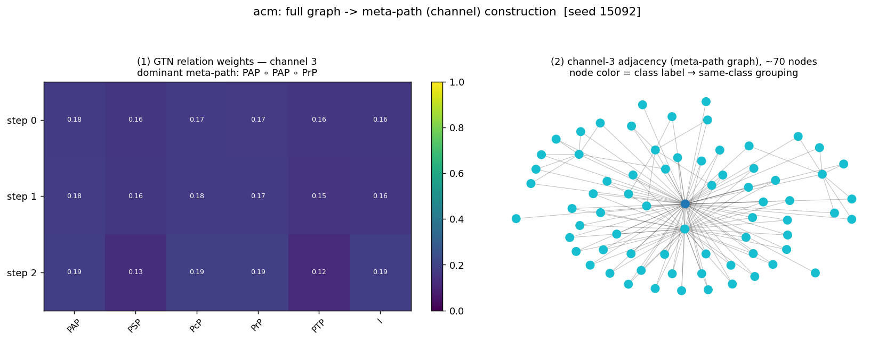
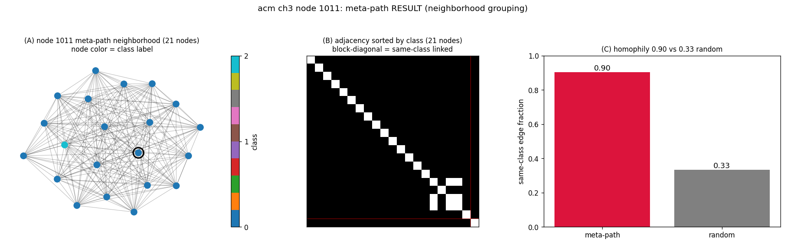
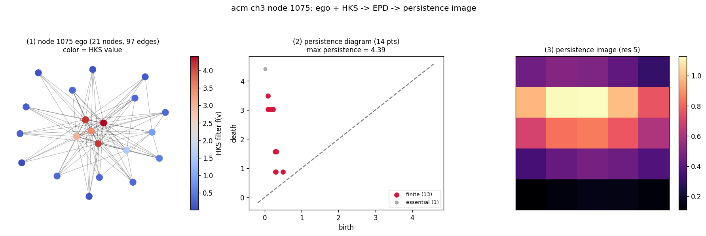

# TDA-HetGNN — 위상 특징이 이종 그래프 노드 분류를 돕는가?

이종(heterogeneous) 그래프에서 **GTN이 자동 발견한 메타패스** 위에 **PDGNN으로 근사한 위상
특징(EPD)** 을 얹어, 두 백본(**HAN**, **RGCN**)의 노드 분류 성능을 비교하는 연구 코드.

> 핵심 질문: (1) 위상 특징이 이종 그래프 학습을 돕는가? (2) 메타패스를 사람이 고르지 않고
> GTN으로 자동 발견해도 되는가? (3) 백본(HAN vs RGCN)에 따라 답이 달라지는가?

## 파이프라인

```
이종 그래프
 └─[GTN]      메타패스(채널) 자동 발견          → 채널별 target–target 인접행렬
     └─[PDGNN]   채널마다 EPD(위상)를 신경망 근사  → 노드별 persistence image
         └─[Semantic Attention Fusion]  채널 위상 특징 융합
             └─[HAN | RGCN]   [원본 feature ⊕ 위상]으로 노드 분류
```

| 모듈 | 출처 | 역할 |
|---|---|---|
| GTN | Yun et al., NeurIPS 2019 | 기저 관계를 가중합·행렬곱으로 합성해 메타패스 채널 자동 발견 |
| PDGNN | Yan et al., NeurIPS 2022 | 확장 persistence diagram(EPD)의 신경망 근사 (필터 = HKS) |
| HAN | Wang et al., WWW 2019 | 메타패스 기반 이종 GNN 백본 |
| RGCN | Schlichtkrull et al., ESWC 2018 | 관계별 weight matrix 백본 (PyG `RGCNConv`) |
| Persistence Image | Adams et al., JMLR 2017 | EPD → 고정 길이 벡터 |

## 실험 설계 — 2 백본 × 3 위상 조건

| | topology 없음 | noisy topology | GTN-PDGNN topology |
|---|:---:|:---:|:---:|
| **HAN** | **(a)** | (b)\* | **(c)** |
| **RGCN** | **(d)** | (e)\* | (f) |

- **(a) HAN only** — node feature만으로 HAN 분류 (위상 없음, baseline).
- **(b) HAN + noisy topology** — 위상 자리에 무작위/노이즈 특징을 넣은 **대조군**.
- **(c) HAN + GTN-PDGNN** — GTN이 발견한 메타패스의 PDGNN EPD 위상 특징을 더함.
- **(d) RGCN only** — node feature만으로 RGCN 분류 (baseline).
- **(e) RGCN + noisy topology** — (b)의 RGCN판 대조군.
- **(f) RGCN + GTN-PDGNN** — (c)의 RGCN판 (위상 특징을 더함).

세 조건의 의도: **없음(a,d) → noisy(b,e) → 진짜 위상(c,f)** 을 비교해서, 성능 향상이 *위상
신호* 때문인지 아니면 *단순히 특징 차원이 늘어서*인지 구분한다 (c가 b를 넘어야 위상 신호가 의미).

\* (b)(e) noisy는 미실행. 현재 **(a)(c)(d) 완료**, (f) 코드·config 준비됨. `backbone ∈ {han, rgcn}`
config 플래그 하나로 백본 전환.

## 결과 (7개 데이터셋 · test Macro-F1 · random seed 10개)

| 데이터셋 | 도메인 | (a) HAN | (c) HAN+위상 | (d) RGCN |
|---|---|---|---|---|
| acm | 학술/인용 | 0.895 | 0.894 | **0.925** |
| dblp | 학술/인용 | 0.786 | 0.862 | **0.934** |
| imdb | 영화(멀티라벨) | 0.438 | 0.450 | **0.636** |
| freebase | 지식그래프 | 0.146 | 0.144 | **0.209** |
| mag | 학술(초대형) | 0.017 | 0.023 | **0.104** |
| aifb | RDF | 0.451 | 0.575 | **0.752** |
| yelp | business(멀티라벨) | 0.110 | 0.091 | 0.055 |

- **위상 효용 (c vs a)**: node feature가 약/없을 때 큼 (dblp +0.08, aifb +0.12), 강하면 ≈0.
- **백본 (d vs a)**: RGCN이 HAN을 6/7에서 크게 상회 (yelp 제외).

전체 표·진행률·매핑은 [`results/SUMMARY.md`](results/SUMMARY.md), 데이터셋 특징은
[`results/DATASETS.md`](results/DATASETS.md).

## 시각화

```bash
python experiments/visualize_pipeline.py <dataset>   # results/figures/<dataset>/ 에 저장
```

세 가지를 생성합니다 (랜덤 노드 100개씩, near-clique degenerate 노드는 자동 제외):

**1. 메타패스 구성** — GTN이 기저관계를 학습 가중치로 합성해 메타패스를 만드는 과정.



**2. 메타패스 결과** (`metapath/` 100개) — 메타패스 이웃의 클래스 묶음 + same-class homophily.



**3. EPD 생성** (`epd/` 100개) — 노드 ego + HKS 필터 → persistence diagram → persistence image.



## 설치 & 실행

```bash
conda create -n tda python=3.9 -y && conda activate tda
pip install -r requirements.txt        # torch / torch_geometric 는 플랫폼 휠 권장
pip install -e .

# (a) HAN 단독
python -m tda.train --config configs/acm.json --dataset acm --no-topology --output-dir runs/a --seed 0
# (c) HAN + GTN-PDGNN 위상
python -m tda.train --config configs/acm.json --dataset acm --output-dir runs/c --seed 0
# (d)/(f) RGCN — config 생성 후 backbone=rgcn config 사용
python experiments/gen_rgcn.py
python -m tda.train --config configs/campaign/acm__d_rgcn.json --dataset acm --output-dir runs/d --seed 0
```

결과는 `runs/<name>/metrics.json`. 클러스터 일괄 실행은 `experiments/run_campaign.slurm` (SLURM 배열,
`%N`으로 동시 GPU 제한). 테스트: `env -u PYTHONPATH CUDA_VISIBLE_DEVICES="" python -m pytest tests/ -q`.

## 새 데이터셋 추가

1. `tda/data/<name>.py` 에 `(PyG HeteroData, target_type)` 로더 작성 → `tda/data/registry.py` 의 `DATASETS` 등록.
2. `configs/<name>.json` 에 `base_relations`(GTN 기저 관계) + `han_metapaths`(HAN 메타패스) 정의.
3. `python -m tda.train --config configs/<name>.json --dataset <name>` 실행.

최소 예시: `tda/data/toy.py` + `configs/toy.json`. 데이터셋별 튜닝값은 전부 config에 있음.

## 코드 구조

```
tda/
  models/      gtn.py  pdgnn.py  han.py  rgcn.py  fusion.py
  topology/    hks.py  epd.py  persistence_image.py  cache.py(재실험용 위상 캐시)
  data/        registry.py + 데이터셋 로더들
  train.py     staged 학습 드라이버 (backbone ∈ {han, rgcn})
  viz.py       per-run 시각화(기본 OFF)
experiments/   gen_rgcn.py  run_campaign.slurm  regen_new.py  visualize_pipeline.py
configs/       데이터셋별 하이퍼파라미터
results/       SUMMARY.md(결과표)  DATASETS.md(데이터셋 특징)
```

## 참고

GTN (NeurIPS'19) · PDGNN (NeurIPS'22) · HAN (WWW'19) · RGCN (ESWC'18) · Persistence Image (JMLR'17).
설계·한계 상세는 [`docs/design.ko.md`](docs/design.ko.md).
